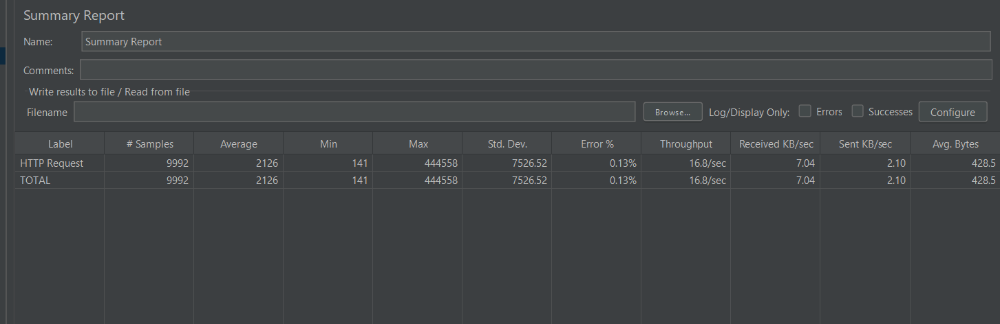
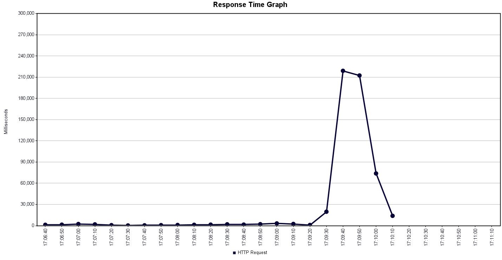
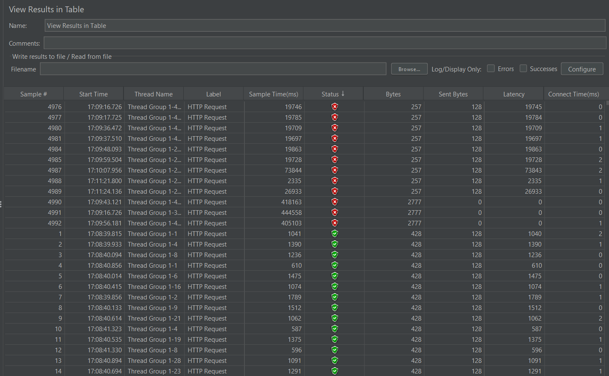

# 🚀 Relatório de Teste de Desempenho com Apache JMeter

## 🎯 Objetivo da Atividade
O objetivo deste teste foi avaliar a capacidade da API REST responsável por consultar dados do ViaCEP, verificando sua robustez e comportamento sob carga crescente. A análise buscou mensurar aspectos essenciais de desempenho, como latência média, picos de resposta, taxa de processamento (throughput), percentual de erros e estabilidade das conexões. A partir desses indicadores, foi possível identificar como o serviço se comporta em um cenário simulado de alta demanda concorrente.

---

## 🔗 Endpoint Testado

 localhost:8080/cep/01310000

---

## ⚙️ Configurações do Teste

- **Number of Threads (Users):** 500  
- **Ramp-Up Period:** 20 segundos  
- **Loop Count:** 10  

---

## 📊 Métricas Coletadas

- **Tempo de Resposta Médio:** 2126 ms  
- **Tempo de Resposta Mínimo:** 141 ms  
- **Tempo de Resposta Máximo:** 444.558 ms (≈ 444 s)  
- **Throughput (Taxa de Transferência):** 16.8 requisições/seg  
- **Erro Percentual:** 0,13%  

> **Observação:** Durante os testes, o uso de VPN resultou no bloqueio temporário do IP, impactando parte das requisições. Essa limitação deve ser considerada ao interpretar os resultados.

---

## 📈 Response Time Graph  
O gráfico abaixo ilustra a variação temporal dos tempos de resposta ao longo da execução do teste. Ele permite identificar padrões de oscilação, momentos de saturação da API e possíveis gargalos associados ao aumento de usuários simultâneos.

---

## 🚀 Taxa de Transferência (Throughput)
O gráfico de throughput demonstra a quantidade média de requisições por segundo processadas pela API. Essa métrica reflete diretamente a sua capacidade operacional diante de cenários de estresse e concorrência elevada.

---

## 📋 Resultados em Tabela
Os dados tabulados abaixo consolidam as estatísticas obtidas, facilitando a comparação entre valores mínimos, médios e máximos, bem como o acompanhamento da estabilidade do serviço ao longo do teste.

---

## 🧾 Conclusão
A análise dos resultados mostrou que a API consegue atender um número significativo de requisições simultâneas, mantendo um percentual de erros baixo. Entretanto, o elevado tempo máximo de resposta indica que, sob carga extrema, o serviço apresenta degradação significativa de desempenho.

Além disso, o bloqueio do IP durante os testes demonstra que o serviço externo pode impor limitações de requisição, interferindo diretamente na execução de cargas mais agressivas. É importante considerar essas restrições ao planejar testes futuros, bem como avaliar possíveis melhorias na arquitetura, cache, paralelismo ou otimização interna da API.

---
